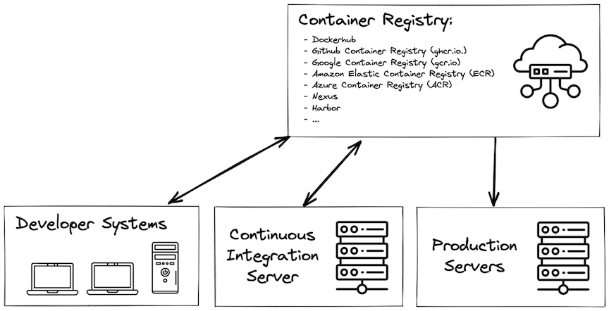
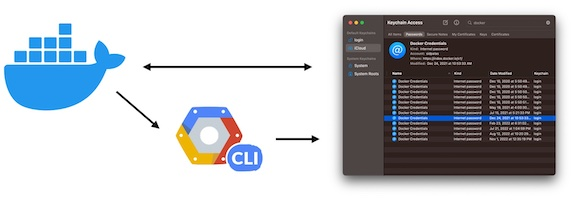

[Home](../README.md) | [History and Motivation](../01-history-and-motivation/README.md)
| [Technology Overview](../02-technology-overview/README.md)
| [Installation and Set Up](../03-installation-and-set-up/README.md)
| [Using 3rd Party Containers](../04-using-3rd-party-containers/README.md)
| [Example Web Application](../05-example-web-application/README.md)
| [Building Container Images](../06-building-container-images/README.md)
| [Container Registries](../07-container-registries/README.md)
| [Running Containers](../08-running-containers/README.md)
| [Container Security](../09-container-security/README.md)
| [Interacting with Docker Objects](../10-interacting-with-docker-objects/README.md)
| [Development Workflows](../11-development-workflow/README.md)
| [Deploying Containers](../12-deploying-containers/README.md)

---

# Container Registries

A container registry is a repository, or collection of repositories, used to store and access container images. They serve as a place to store and share container images between developer systems, continuous integration servers, and deployment environments.

Examples of popular container registries include:

- [Dockerhub](https://hub.docker.com)
- [Github Container Registry (ghcr.io.)](https://docs.github.com/en/packages/working-with-a-github-packages-registry/working-with-the-container-registry)
- [Gitlab Container Registry](https://docs.gitlab.com/ee/user/packages/container_registry/)
- [Google Container Registry (gcr.io)](https://cloud.google.com/container-registry)
- [Amazon Elastic Container Registry (ECR)](https://aws.amazon.com/ecr/)
- [Azure Container Registry (ACR)](https://azure.microsoft.com/en-us/products/container-registry)
- [jFrog Container Registry](https://jfrog.com/container-registry/)
- [Nexus](https://blog.sonatype.com/nexus-as-a-container-registry)
- [Harbor](https://goharbor.io/)

## Authenticating to Container Registries

While you can pull many public images from registries without authenticating, in order to push images to a registry, or pull a private image, you will need to authentic

Docker can login directly to some registries with basic authentication (username/password) or call out to separate programs known as credential helpers. For example, to authenticate to the Google Container Registry, docker uses the `gcloud` command line utility from GCP (https://cloud.google.com/container-registry/docs/advanced-authentication#gcloud-helper). 

If available, Docker can also store the credentials in a secure store (`macOS keychain`, `Windows Credential Manager`) to help protect those credentials.

