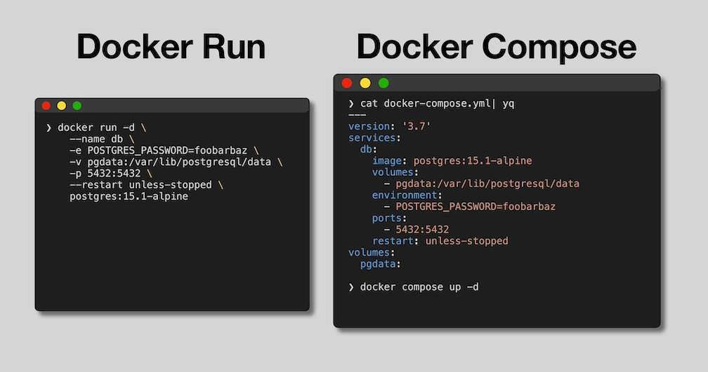

# Running Containers (with Docker)

There are two primary ways to run docker containers, with `docker run` and `docker compose up`. 



Docker run takes a single container image and runs a container based on it, while docker compose takes a specification of 1 or more services and can build container images for them and/or run containers from those images.

Generally `docker run` is preferable for one off quick use cases (for example those described in `04-using-3rd-party-containers`) while docker compose is preferable if you are developing a containerized application with more than one service.

## individual docker run commands

The portion of the Makefile labeled `### DOCKER CLI COMMANDS` shows the commands can would use to build and run all of these services. To build the images and then run them you can execute:

```bash
make docker-build-all
make docker-run-all
```

***Note:*** Because the Dockerfiles and application source code are located in different directories, the build commands appear more complicated than they actually are. Generally the Dockerfile would live alongside the application and the command would be more like `docker build -t <TAG> .` (and docker defaults to choosing the Dockerfile in the local directory).

You will notice that each of the run commands has a bunch of options used to ensure the configuration works properly.

- Uses the default docker bridge network
- Uses `--link` to enable easy host name for network connections
- Publishing ports (`-p` option) useful to connect to each service individually from host, but only necessary to connect to the frontend
- Named containers make it easier to reference (e.g. with link), but does require removing them to avoid naming conflict
- Restart policy allows docker to restart the container (for example if database weren't up yet causing one of the api servers to crash)

## docker compose

Using docker compose allows encoding all of the logic from the `docker build` and `docker run` commands into a single file. Docker compose also manages naming of the container images and containers, attaching to logs from all the containers at runtime, etc...

The `docker-compose.yml` file and the portion of the Makefile labeled `### DOCKER COMPOSE COMMANDS` shows how you can use docker compose to build and run the services. To build and run them you can execute

```bash
make compose-up-build
```

As you can see, this is much simpler than needing to execute all of the individual build/run commands and provides a clear way to specify the entire application stack in a single file!

# Important Configuration Options

The example shows many configuration options, but does not cover them all.

Documentation: https://docs.docker.com/engine/reference/run/.

All of the command line flags/options can also be specified them within a compose file: https://docs.docker.com/compose/compose-file/

Here are a set of options everyone should know:
```
-d
--entrypoint
--env, -e, --env-file
--init
--interactive, -i
--mount, --volume, -v
--name
--network, --net
--platform
--publish, -p
--restart
--rm
--tty, -t
```

Here are a set of less commonly used options, but still worth knowing about:

```bash
--cap-add, --cap-drop
--cgroup-parent
--cpu-shares
--cpuset-cpus (pin execution to specific CPU cores)
--device-cgroup-rule,
--device-read-bps, --device-read-iops, --device-write-bps, --device-write-iops
--gpus (NVIDIA Only)
--health-cmd, --health-interval, --health-retries, --health-start-period, --health-timeout
--memory , -m
--pid, --pids-limit
--privileged
--read-only
--security-opt
--userns
```
